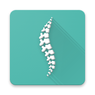

# SmartSeat App
App for iOS and Android for SmartSeat tool @unibo
<div style="text-align:center">
  
</div>

Smart Seat è un cuscino che riconosce la postura corretta. Ciò è possibile in quanto all’interno del cuscino sono presenti celle di carico integrate che rilevano la pressione che l’utente assume su di esso quando è seduto. Il sistema è connesso wireless con un server che si occupa della memorizzazione e dell’elaborazione dei dati rilevati dai sensori, nonchè di estrapolare lo stato della postura attraverso un algoritmo di Machine Learning.
L’utente può monitorare lo stato della propria postura in real-time attraverso un applicazione mobile direttamente dal proprio smartphone.

Smart Seat riconosce **3 stati**:
- Postura corretta
- Postura scorretta
- Non seduto

L’applicazione, oltre a segnalare all’utente lo stato attuale del cuscino, fornisce una cronologia giornaliera delle posture assunte tramite grafici a linee e torta.

Inoltre è presente un ulteriore grafico a linee in cui viene visualizzata una stima settimanale, raggruppata per giorni, dei minuti totali giornalieri trascorsi in ciascuno degli stati elencati sopra.

#### Screen app
<div style="text-align:center">
  
  
</div>

#### Run on Android

```console
 react-native run-android
```
#### Run on iOS

```console
 react-native run-ios
```
